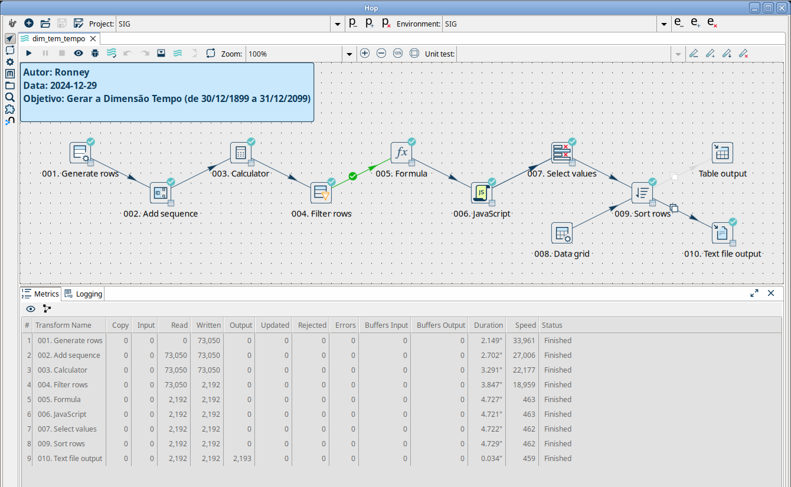

# Dimensão Tempo

## Objetivo
Realizar a carga da dimensão Tempo para uso em um Data Warehouse.

A estrutura definida permite uma maior capacidade de análise temporal por meio da estratificação de datas e períodos variados.

## Ferramenta
Apache Hop 2.9

## Processo
O processo gerará um conjunto de dados com vários atributos dentro do período de 30/12/1899 a 31/12/2100.

## Saída
Os campos resultantes são os seguintes:
- tem\_cod\_srk\_tempo: Chave única para identificar um data no conjunto de tempo especificado
- tem\_dat\_bsk\_tempo: Um data qualquer dentro do período especificado para a dimensão (por exemplo, 30/12/1899);
- tem\_str\_data\_dmy: Data como texto no formato DD/MM/YYYY (por exemplo, 30/12/1899);
- tem\_str\_data\_ymd: Data como texto no formato YYYY-MM-DD (por exemplo, 1899-12-30);
- tem\_str\_data_extenso: Descrição do dia por extenso (por exemplo, "Sábado, 30 de Dezembro de 1899");
- tem\_cod\_dia: Dia do mês (valores de 1 a 31);
- tem\_str\_dia: Dia do mês como texto (valores de "01" a "31");
- tem\_cod\_dia\_semana: Dia da semana (valores de 1 a 7);
- tem\_str\_dia\_semana: Dia da semana como texto (valores de "01" a "07");
- tem\_str\_dia\_semana_sigla: Descrição curta do dia da semana (valores de "Dom" a "Sáb");
- tem\_str\_dia\_semana_curto: Descrição do dia da semana (valores de "Domingo", "Segunda", ...., "Sexta", "Sábado");
- tem\_str\_dia\_semana_completo: Descrição do dia da semana (valores de "Domingo, "Segunda-feira", ...., "Sexta-feira", "Sábado");
- tem\_cod\_dia\_ano: Dia no ano (valores de 1 a 366);
- tem\_str\_dia\_ano: Dia no ano como texto (valores de "001" a "366");
- tem\_cod\_semana\_ano: Semana no ano (valores de 1 a 52);
- tem\_str\_semana\_ano: Semana no ano como texto (valores de "01" a "52");
- tem\_cod\_mes: Mês do ano (valores de 1 a 12);
- tem\_str\_mes: Mês do ano como texto (valores de "01" a "12");
- tem\_str\_mes_sigla: Sigla do mês do ano (valores de "Jan" a "Dez");
- tem\_str\_mes_descricao: Descrição do mês do ano (valores de "Janeiro" a "Dezembro");
- tem\_cod\_competencia: Competência (valores como 190001, 202001, 202412, 202501 etc.)
- tem\_str\_competencia: Competência como texto (valores como "01/1900", "01/2020", "12/2024", "01/2025" etc.)
- tem\_str\_competencia1: Competência como texto em outro formato (valores como "Jan/1900", "Jan/2020", "Dez/2024", "Jan/2025" etc.)
- tem\_str\_competencia2: Competência como texto em outro formato (valores como "1900-01", "2020-01", "2024-12", "2025-01" etc.)
- tem\_flg\_primeiro\_dia\_competencia: Indica se a data é primeiro dia da competência ("S", "N");
- tem\_flg\_ultimo\_dia\_competencia: Indica se a data é último dia da competência ("S", "N");
- tem\_cod\_bimestre: Bimestre do ano (valores de 1 a 6);
- tem\_str\_bimestre: Bimestre do ano como texto (valores "Jan-Fev", "Mar-Abr", "Mai-Jun", "Jul-Ago", "Set-Out", "Nov-Dez");
- tem\_flg\_primeiro\_dia\_bimestre: Indica se a data é primeiro dia do bimestre ("S", "N");
- tem\_flg\_ultimo\_dia\_bimestre: Indica se a data é último dia do bimestre ("S", "N");
- tem\_cod\_trimestre: Trimestre do ano (valores de 1 a 4);
- tem\_str\_trimestre: Bimestre do ano como texto (valores "Jan-Mar", "Abr-Jun", "Jul-Set", "Out-Dez");
- tem\_flg\_primeiro\_dia\_trimestre: Indica se a data é primeiro dia do trimestre ("S", "N");
- tem\_flg\_ultimo\_dia\_trimestre: Indica se a data é último dia do trimestre ("S", "N");
- tem\_cod\_quadrimestre: Quadrimestre do ano (valores de 1 a 3);
- tem\_str\_quadrimestre: Quadrimestre do ano como texto (valores "Jan-Abr", "Mai-Ago", "Set-Dez");
- tem\_flg\_primeiro\_dia\_quadrimestre: Indica se a data é primeiro dia do quadrimestre ("S", "N");
- tem\_flg\_ultimo\_dia\_quadrimestre: Indica se a data é último dia do quadrimestre ("S", "N");
- tem\_cod\_semestre: Semestre do ano (valores de 1 a 2);
- tem\_str\_semestre: Semestre do ano como texto (valores "Jan-Jun", "Jul-Dez");
- tem\_flg\_primeiro\_dia\_semestre: Indica se a data é primeiro dia do semestre ("S", "N");
- tem\_flg\_ultimo\_dia\_semestre: Indica se a data é último dia do semestre ("S", "N");
- tem\_cod\_ano: Ano (valores de 1899 a 2099);
- tem\_str\_ano: Ano como texto (valores de "1899" a "2099");
- tem\_flg\_primeiro\_dia\_ano: Indica se a data é primeiro dia do ano ("S", "N");
- tem\_flg\_ultimo\_dia\_ano: Indica se a data é último dia do ano ("S", "N");
- tem\_cod\_bienio: Ano inicial de um período de 2 anos (valores como 1899, 1901, 1903 ... 2023, 2025 ... 2095, 2097, 2099);
- tem\_str\_bienio: Período de 2 anos como texto (valores como "1899-1900", "1901-1902", "1903-1904" ... "2023-2024", "2025-2026" ... "2097-2098", "2099-2100");
- tem\_flg\_primeiro\_dia\_bienio: Indica se a data é primeiro dia do biênio ("S", "N");
- tem\_flg\_ultimo\_dia\_bienio: Indica se a data é último dia do biênio ("S", "N");
- tem\_cod\_quinquenio: Ano inicial de um período de 5 anos (valores como 1896, 1901, 1906 ... 2021, 2026 ... 2091, 2096);
- tem\_str\_quinquenio: Período de 5 anos como texto (valores como "1896-1900", "1901-1905" ... "2021-2025", "2026-2030" ... "2091-2095", "2096-2100");
- tem\_flg\_primeiro\_dia\_quinquenio: Indica se a data é primeiro dia do quinquênio ("S", "N");
- tem\_flg\_ultimo\_dia\_quinquenio: Indica se a data é último dia do quinquênio ("S", "N");
- tem\_cod\_decada: Ano inicial de um período de 10 anos (valores de 1891, 1901, 1911 ... 2011, 2021 ... 2081, 2091);
- tem\_str\_decada: Década como texto (valores de "1891-1900", "1901-1910" ... "2011-2020", "2021-2030" ... "2081-2090", "2091-2100");
- tem\_flg\_primeiro\_dia\_decada: Indica se a data é primeiro dia da década ("S", "N");
- tem\_flg\_ultimo\_dia\_decada: Indica se a data é último dia da década ("S", "N").

Como pode ser visto na figura, o resultado do processo está direcionado para um arquivo CSV pela *transform* "Text file output", mas também pode ser direcionado a uma tabela de banco de dados (por uma *transform* "Table output").

O arquivo ["dim_tem_tempo.csv"](dim_tem_tempo.csv) é uma amostra do resultado total do processo mostrando apenas os seguintes intervalos de datas:
- 30/12/1899 a 31/12/1901;
- 01/01/2024 a 31/12/2025;
- 01/01/2099 a 31/12/2100.

